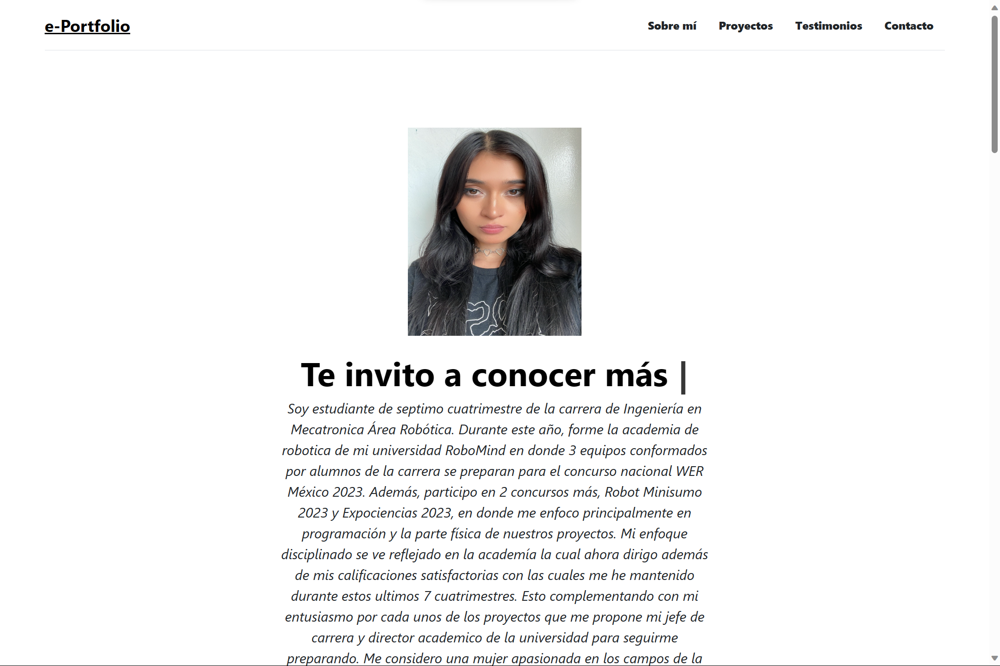

# Portafolio personal: Tecnolochicas PRO

Descripción de mi proyecto
Este proyecto fue creado durante el bootcamp Technolochicas PRO, es una página responsiva( adaptable a distintos dispositivos).

El próposito de la creación de este sitio web es mostrar el portafolio de proyectos de la desarrolladora y su experiencia alrededor del área.

- Incluye las secciones: sobre mi, proyectos, testimonios, contacto.

- Incluye recursos multimedia.

<a href="https://mye-portfolio.netlify.app">**Visitar mi e-portfolio** </a>

## Objetivos de aprendizaje

Dotar a las adolescentes con habilidades digitales y de empleabilidad, a través de enseñanza de programación (HTML, CSS, GitHub y JavaScript) y conocimiento para que inicien en el mundo profesional tecnológico.

## Tecnologías
e-Portfolio construido con:

- 

- 

- 

## 📬 Contacto

Si estás interesad@ en compartir o conectar para algún proyecto u oportunidad laboral, contáctame.

<a href="https://www.linkedin.com/in/akari-paola-montoya-altamira-3380b3296//"></img></a>

© 2023 Akari (Programa Technolochicas PRO)

<!-- FOOTER, COMO INSTALARLO Y COMO USARLO-->

